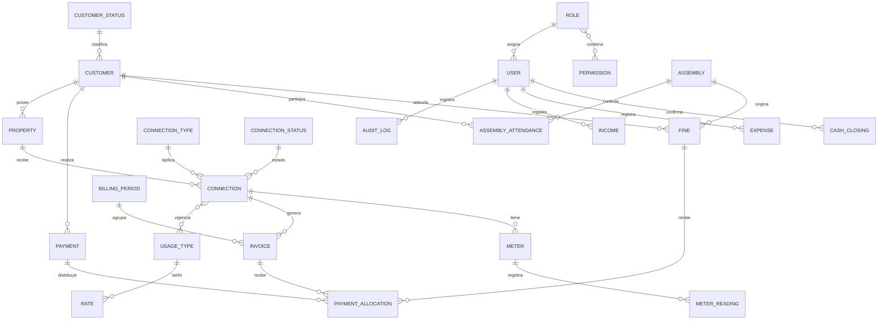

# Arquitectura técnica

## 1. Resumen

El sistema es una aplicación monolítica Laravel con renderizado del lado del servidor mediante Blade. La lógica de negocio sensible está separada en servicios y las operaciones de escritura importantes utilizan transacciones de base de datos.

```text
Navegador
  │
  ├── Sitio público: consulta por DNI
  └── Sesión autenticada
        │
        ├── Controladores web + vistas Blade
        ├── API interna /api/v1
        └── Middleware de actividad y permisos
                 │
                 ├── Servicios de dominio
                 ├── Modelos Eloquent
                 └── MySQL / MariaDB
```

## 2. Capas principales

### Presentación

- `resources/views`: vistas Blade.
- `resources/css`: estilos procesados por Tailwind CSS.
- `resources/js`: entrada de JavaScript de Vite.
- `resources/views/layouts/app.blade.php`: interfaz autenticada, menú lateral y menú de usuario.
- `resources/views/layouts/public.blade.php`: interfaz pública.

### Controladores web

- `PublicDebtController`: consulta pública por DNI.
- `AuthenticatedSessionController`: inicio y cierre de sesión.
- `PasswordController`: cambio de contraseña propia.
- `JassPageController`: dashboard y mantenimiento genérico de recursos.
- `CollectionController`: búsqueda del cliente y cobranza.
- `ReceiptController`: recibo térmico y anulación.
- `AttendanceScannerController`: lector continuo de DNI.
- `DelinquencyController`: vista de morosidad real.
- `ReportController`: exportación Excel y PDF.

### Servicios de dominio

| Servicio | Responsabilidad |
| --- | --- |
| `BillingService` | Emisión mensual, frecuencia, fechas de vencimiento y recuperación de plazos. |
| `DebtService` | Saldos pendientes, morosidad, mora calculada y sincronización de estados. |
| `PaymentCollectionService` | Cobro transaccional y distribución entre cuotas/multas. |
| `PaymentCancellationService` | Anulación, reapertura de deuda y control de periodos cerrados. |
| `CashService` | Saldo vivo, vista previa y cierre de caja. |
| `AssemblyFineService` | Preparación de asistencias y multas por inasistencia. |
| `MeterReadingService` | Validación y recálculo de lecturas/consumos. |
| `ReportService` | Construcción neutral de reportes para Excel y PDF. |
| `AuditService` | Captura de cambios y persistencia de la bitácora. |

### Persistencia

Los modelos usan Eloquent. Los códigos automáticos se centralizan en `App\Support\Codes\CodeGenerator` y la tabla `code_sequences`.

## 3. Modelo de datos conceptual



## 4. Autenticación y autorización

La aplicación usa sesiones de Laravel.

1. `auth` exige una sesión válida.
2. `active` impide el acceso de usuarios desactivados y cierra su sesión.
3. `permission` verifica el permiso según ruta y recurso.
4. El rol `ADMINISTRATOR` omite la comprobación individual y tiene acceso total.

Las operaciones de inicio de sesión, consulta pública y cambio de contraseña tienen límites de solicitudes.

### Matriz inicial de roles

| Rol | Permisos iniciales |
| --- | --- |
| Administrador | Todos los permisos existentes. |
| Cajero | `customers.view`, `payments.create`, `reports.view`. |
| Contabilidad | `customers.view`, `rates.manage`, `cash.manage`, `reports.view`. |
| Auditor | `customers.view`, `reports.view`, `audit.view`. |
| Operador | `customers.view`, `customers.create`, `customers.update`, `connections.create`, `services.manage`, `assemblies.manage`, `reports.view`. |

El catálogo inicial de permisos contiene:

- `customers.create`, `customers.update`, `customers.view`.
- `connections.create`, `services.manage`.
- `payments.create`, `rates.manage`, `cash.manage`.
- `assemblies.manage`, `reports.view`.
- `users.manage`, `audit.view`.

La asignación rol-permiso se inicializa mediante `JassAccessSeeder`. La interfaz permite mantener usuarios, roles y permisos como registros, pero todavía no incorpora un editor específico para la tabla de asociaciones entre roles y permisos. Si se cambia esa matriz, debe hacerse mediante una migración o seeder versionado y probarse antes de desplegar.

## 5. Rutas web relevantes

| Método y ruta | Función | Acceso |
| --- | --- | --- |
| `GET /` | Página pública | Público |
| `POST /consultar-deuda` | Consulta por DNI | Público, limitado |
| `GET/POST /ingresar` | Inicio de sesión | Invitado |
| `POST /salir` | Cierre de sesión | Autenticado |
| `GET /panel` | Dashboard | `reports.view` |
| `GET /morosidad` | Morosos reales | `reports.view` |
| `GET/POST /cobranza` | Buscar y cobrar | `payments.create` |
| `GET /recibos/{id}/imprimir` | Recibo térmico | `reports.view` |
| `GET/PATCH /recibos/{id}/anular` | Anulación | `payments.create` |
| `GET/POST /asistencias/lector` | Escáner de DNI | `assemblies.manage` |
| `GET /reportes/{reporte}/{formato}` | Exportación | `reports.view` |
| `/gestion/{recurso}` | CRUD genérico Blade | Permiso por recurso |
| `GET/PUT /mi-cuenta/contrasena` | Contraseña propia | Autenticado activo |

## 6. API interna

La API usa el prefijo `/api/v1` y el mismo controlador de recursos. No es todavía una API pública con tokens: comparte autenticación de sesión web y permisos. Un cliente externo no debe depender de ella hasta implementar un guard como Sanctum y versionar formalmente los contratos.

Patrón general:

```text
GET    /api/v1/{resource}?per_page=15
POST   /api/v1/{resource}
GET    /api/v1/{resource}/{id}
PUT    /api/v1/{resource}/{id}
DELETE /api/v1/{resource}/{id}
```

`per_page` acepta de 1 a 100. Las respuestas de listado usan la paginación estándar de Laravel.

Recursos expuestos:

- Administración: `roles`, `permissions`, `users`, `settings`, `audit-logs`.
- Clientes: `customer-statuses`, `customers`, `neighborhoods`, `properties`.
- Servicios: `connection-types`, `connection-statuses`, `connections`, `usage-types`, `connection-usage-types`, `meters`, `meter-readings`.
- Facturación: `billing-periods`, `late-fee-settings`, `rates`, `invoices`, `payments`, `payment-methods`.
- Asambleas: `assembly-types`, `assemblies`, `assembly-attendances`, `fines`.
- Caja: `income-types`, `incomes`, `expense-categories`, `expenses`, `cash-closings`.

Restricciones especiales:

- `audit-logs` es solo lectura.
- `invoices`, `payments` y `fines` no admiten escritura genérica; deben crearse mediante sus flujos de negocio.
- Los cierres de caja se crean mediante el cálculo del servicio y no pueden editarse ni eliminarse.
- Ingresos y egresos ignoran un `user_id` enviado por el cliente y usan al usuario autenticado.

## 7. Integridad y concurrencia

- Cobros, anulaciones, cierres y lecturas usan transacciones.
- Los conceptos de un cobro se bloquean durante la operación.
- Las secuencias se bloquean antes de incrementar el correlativo.
- Existe unicidad por conexión/mes para cuotas.
- El número de operación de pago es único.
- Existe una sola distribución de un pago hacia la misma cuota o multa.
- Las restricciones foráneas evitan eliminar catálogos que ya tienen uso.

## 8. Auditoría

La bitácora registra `INSERT`, `UPDATE` y `DELETE`, con:

- Usuario.
- Tabla.
- Identificador del registro.
- Valores anteriores.
- Valores nuevos.
- Fecha y hora.

No se auditan cambios sobre la propia tabla de auditoría. Contraseñas y tokens están excluidos de las instantáneas.

## 9. Internacionalización

La aplicación establece español como idioma y `America/Lima` como zona horaria. Los mensajes de autenticación, validación, paginación y errores HTTP tienen traducciones propias en `lang/es` y `resources/views/errors`.

## 10. Pruebas

Las pruebas de características cubren, entre otros:

- Autorización y usuarios.
- Generación según día configurado.
- Morosidad trimestral/semestral.
- Caja y cierres.
- Eliminación protegida de catálogos.
- Medidores y lecturas.
- Número de operación.
- Filtros de recibos.
- Anulación de pagos.
- Reportes y balance anual.
- Auditoría y localización.

`phpunit.xml` y `tests/TestCase.php` fuerzan SQLite en memoria y abortan si la conexión de pruebas no es esa. Esta protección evita tocar accidentalmente la base operativa.

## 11. Extensiones previstas

- Facturación automática de consumos medidos usando lectura y precio por metro cúbico.
- Autenticación por token para integraciones externas.
- Acción web para emitir y cobrar anticipadamente varios meses futuros.
- Editor visual de permisos asociados a cada rol.
- Política formal de retención y exportación de la bitácora.
