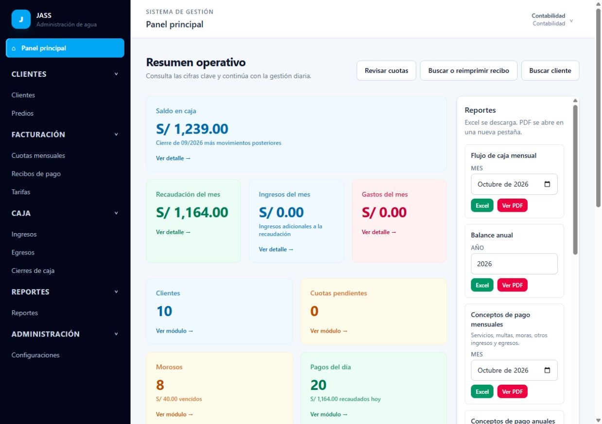

# Informe de pruebas de funcionamiento y facilidad de uso de JASS

Fecha: 6 de octubre de 2026, America/Lima. Proyecto probado: `C:/Users/IGP/Desktop/jass`. Servidor local: `http://127.0.0.1:8000`. No se aplicaron correcciones al código funcional de la aplicación.

## Resultado general

Los flujos principales ensayados funcionaron: alta de diez clientes y sus servicios, facturación fija y por consumo, dos ciclos trimestrales completos, cobros, anulación y reposición, asistencia, multas, consulta pública, auditoría y conciliación de caja. Los permisos comprobados separan correctamente los cinco roles. No se reprodujeron errores de cálculo en los importes de esta simulación.

Se encontraron tres defectos reproducibles: reinicialización de MySQL bloqueada por objetos residuales, códigos vacíos de usuarios iniciales y ceros omitidos en Excel. También hay dificultades importantes para personas con poca experiencia, especialmente en el alta del servicio, el vocabulario, la navegación entre módulos y el registro de referencias de pagos.

La prueba de teléfono queda pendiente: la herramienta de navegador no aplicó el tamaño solicitado. Este informe no certifica la experiencia móvil ni la impresión física.

## Limpieza y protección de los datos anteriores

Se verificó que el entorno era local y que la conexión era MySQL, base `jass`. Antes de limpiar se guardó `tmp/respaldo-antes-pruebas-2026-10-06.json`, con las filas de las tablas y vistas, incluidos los usuarios existentes. Es un respaldo de datos JSON; no sustituye un volcado SQL con esquema y rutinas. Contiene datos privados y hashes de acceso: mantenerlo local y fuera de publicaciones.

La reinicialización falló primero por vistas persistentes y luego por el procedimiento `generate_assembly_fines`. Para completar la limpieza se retiró ese procedimiento residual y se ejecutó `php artisan migrate:fresh --drop-views --seed --force`. Las 17 migraciones y ambos seeders terminaron correctamente. Después se crearon los nuevos datos ficticios. El respaldo permanece disponible; no se restauró porque el objetivo era dejar la simulación en el sistema.

## Datos simulados y conciliación

Se registraron por formularios diez personas, con documentos ficticios 99000001 a 99000010 y apellidos que incluyen «Prueba». Cada una tiene un predio y una conexión instalados el 01/01/2026. Ocho conexiones usan cuota fija de S/ 15 al mes; dos usan medidor, con precio S/ 2 por m³ y consumos mensuales de 10 y 12 m³. Se registraron dos medidores y doce lecturas.

| Ciclo | Cuotas | Servicio | Vencimiento | Mora cobrada el 06/10/2026 | Cobros válidos |
| --- | ---: | ---: | --- | ---: | ---: |
| Enero-marzo de 2026 | 30 | S/ 492 | 30/04/2026 | S/ 120 | S/ 612 |
| Abril-junio de 2026 | 30 | S/ 492 | 31/07/2026 | S/ 60 | S/ 552 |
| Total | 60 | S/ 984 | Dos ciclos completos | S/ 180 | S/ 1.164 |

Los meses de servicio se simularon con fechas históricas; los pagos de la interfaz se registraron en la fecha actual, por lo que corresponde mora. No se simularon seis meses de operación real del servidor. Las pruebas automatizadas complementarias sí controlan el reloj para verificar vencimiento, gracia y pagos en distintas fechas.

Se generaron veinte recibos válidos, uno por cliente y ciclo, usando EFECTIVO, YAPE, PLIN y TRANSFERENCIA. Se anuló RC26-000020 por S/ 78; reabrió exactamente tres cuotas y S/ 6 de mora del segundo ciclo. RC26-000021 volvió a cobrar ese importe. Resultado: 21 recibos conservados, 20 válidos por S/ 1.164 y uno anulado por S/ 78. Las 60 cuotas quedaron pagadas.

Una asamblea tuvo diez convocados, dos asistentes y ocho inasistentes; generó ocho multas de S/ 5. Se dejaron pendientes para verificar la consulta pública y la morosidad: ocho clientes deben S/ 40 únicamente por multas. «Cuotas pendientes: 0» y «Morosos: 8» son resultados compatibles, no un error.

El usuario confirmó desde contabilidad un ingreso ficticio de S/ 100, un egreso ficticio de S/ 25 y el cierre de septiembre por S/ 75. La revisión automática de acciones había impedido al agente realizar esos envíos finales. Se verificaron sus registros y auditoría después de la intervención del usuario.

Saldo final: S/ 75 de cierre anterior + S/ 1.164 de cobros de octubre = **S/ 1.239**. El panel y el servicio de caja coinciden. Las multas pendientes no aumentan caja.

## Usuarios y permisos comprobados

Se consultaron las cuentas en «Usuarios del sistema» y se inició sesión en la interfaz con las cinco. No se cambiaron sus contraseñas. Además, se ejecutaron 65 solicitudes GET a través del kernel HTTP real de Laravel, con autenticación de cada rol y middleware habilitado. Esto comprueba acceso a páginas y formularios, no equivale a ejecutar todas las modificaciones posibles de cada módulo.

| Rol | Operación comprobada | Restricciones comprobadas |
| --- | --- | --- |
| Administrador | Alta de clientes, predios, conexiones, medidores y lecturas; nueva versión de tarifa; emisión mensual; consulta de usuarios | La creación de registros de auditoría está bloqueada incluso para administrador |
| Caja | Cobrar ambos ciclos a diez clientes, ver recibos, anular y volver a cobrar | No puede registrar clientes, emitir cuotas, usar caja administrativa, registrar asistencia ni administrar usuarios |
| Operador | Crear asamblea, registrar asistencia, evitar duplicación y cerrar asamblea con multas | No puede cobrar, emitir cuotas, registrar ingresos/egresos o administrar usuarios; formularios de clientes y conexiones accesibles |
| Contabilidad | Formularios de ingreso y cierre, consulta de tarifas, mora y reportes; registros confirmados por el usuario | No puede cobrar por ventanilla, registrar clientes, gestionar asambleas ni administrar usuarios |
| Auditoría | Leer bitácora, clientes y reportes | No puede registrar clientes, cobrar, emitir cuotas, registrar movimientos o crear entradas de bitácora |

No se observó acceso indebido en estas rutas. Que auditoría no acceda al módulo de caja o conexiones es la política actual; los reportes de flujo de caja y padrón sí están disponibles. Si debe inspeccionar esos registros directamente, es una decisión de permisos, no un fallo demostrado.

## Pruebas realizadas

| Prueba | Resultado y evidencia |
| --- | --- |
| Formulario vacío de cliente | El navegador pide completar el campo obligatorio |
| Alta de diez clientes, predios y conexiones | Guardado correcto; códigos CLI, PRD y SUM correlativos |
| Búsqueda por DNI y código | Permite seleccionar cliente y predio correctos |
| Conexión medida sin precio por m³ | La revisión explica la omisión; no inventa un precio fijo |
| Lectura 90 frente a lectura inicial 100 | Rechazada con explicación; conserva los datos para corregir |
| Doce lecturas consecutivas | Consumos correctos de 10 y 12 m³ en seis meses |
| Emisión de enero a junio | Diez cuotas por mes, 60 en total; fechas de ambos ciclos correctas |
| Revisión posterior de enero emitido | Diez existentes, ninguna nueva; avisa que no se duplicarán |
| Selección por ciclo y total | S/ 57 y S/ 51 por cliente fijo; incluye mora una sola vez por ciclo |
| Confirmación de cobro | Muestra titular, conceptos, medio e importe antes de guardar |
| Anulación y reposición | Conserva trazabilidad y restaura exactamente S/ 78 de deuda |
| Asistencia duplicada | Informa que ya estaba registrado; el contador no se duplica |
| Cierre de asamblea | Ocho multas para los ocho ausentes, S/ 40 en total |
| Consulta pública | Cliente pagado: sin deuda; cliente con multa: S/ 5; DNI inexistente: explicación clara |
| Caja y cierre | S/ 75 de cierre y S/ 1.239 de saldo global; usuario y fechas correctos |
| Guardas de caja, sin escrituras | Rechazan fecha de periodo cerrado, cierre repetido y cierre del mes actual; permiten fecha de octubre |
| Once reportes en dos formatos | 22 respuestas correctas del controlador; firmas PDF/XLSX válidas |
| Botón Excel en la interfaz | Descarga correcta del reporte mensual de conceptos |
| Revisión de tres PDF | Conceptos, asistencias y padrón legibles, sin recortes observados |
| Suite automatizada existente | 81 pruebas correctas, 1.371 verificaciones; SQLite en memoria, sin limpiar MySQL |

La revisión automática de exportaciones usó directamente el controlador y las librerías de la aplicación. La validación de permisos a reportes se hizo por HTTP por separado. En el navegador integrado no se pudo certificar la apertura de una nueva pestaña PDF; el destino del botón es correcto y los archivos generados sí se renderizaron fuera de ese visor.

## Errores reproducidos y correcciones recomendadas

### E01. Reinicialización incompleta de MySQL - prioridad alta

**Pasos:** en una instalación con vistas y rutina ya creadas, ejecutar `php artisan migrate:fresh --seed --force`. La migración de objetos de reportes falla porque `vw_customer_account` ya existe. Añadir `--drop-views` resuelve las vistas, pero luego falla porque `generate_assembly_fines` ya existe.

**Efecto:** la base queda parcialmente recreada y no se completa la instalación ni el seed. No es un error de cobranza, pero sí bloquea mantenimiento y limpieza.

**Recomendación:** establecer un procedimiento de reinicialización que retire explícitamente vistas y rutinas de JASS; hacer robusta la migración de esos objetos y añadir una prueba con MySQL. Las pruebas actuales en SQLite no ejercitan esta migración específica. En esta sesión se solucionó el bloqueo operativo sin modificar el código de la migración.

### E02. Usuarios iniciales sin código - prioridad media

**Pasos:** limpiar, migrar, ejecutar seeders y abrir «Usuarios del sistema». Los cinco usuarios muestran «—» en código; la comprobación de datos confirma cinco `user_code` nulos.

**Esperado:** códigos USR correlativos, como documenta el sistema. Clientes, predios y suministros sí obtuvieron códigos.

**Causa probable:** `DatabaseSeeder` usa `WithoutModelEvents`, mientras la generación de códigos depende de eventos del modelo.

**Recomendación:** asignar explícitamente los códigos durante el seed o permitir sus eventos de generación; corregir también usuarios iniciales ya instalados y verificar unicidad.

### E03. Excel convierte importes cero en celdas vacías - prioridad media

**Pasos:** generar el Excel de conceptos mensuales de octubre de esta simulación. B5 contiene 984 y B7 contiene 180, pero B6 («Multas»), B8 («Otros ingresos») y B9 («Egresos») están vacías. El PDF equivalente muestra S/ 0.00 en esas filas.

**Efecto:** un usuario puede interpretar el espacio como dato faltante; las funciones de conteo y comprobación de integridad distinguen una celda vacía de un cero.

**Causa probable:** `ReportController::excel` usa `fromArray(..., null, ...)` sin comparación estricta de nulos.

**Recomendación:** escribir ceros explícitos o usar comparación estricta; probar también conteos de cero en tablas de resumen de otros reportes. El total de cobros observado sigue siendo correcto.

## Riesgos detectados en la revisión técnica

Estos puntos son indicios del código o documentación; no se presentan como errores reproducidos en la interfaz.

- El procedimiento MySQL de multas distingue `EXEMPT`, pero el catálogo instala `EXONERADO`; además, no comprueba que la asamblea esté realizada. Si se invoca directamente podría aplicar reglas distintas a las del servicio Laravel. No se llamó durante estas pruebas. Unificar ambas implementaciones o retirar la rutina si no se utiliza.
- La vista MySQL `vw_delinq_customers` filtra cuotas pendientes, sin comparar vencimiento ni incorporar multas. Puede diferir del reporte Laravel de morosidad. Revisar antes de usarla para integraciones; no se observó este error en el panel.
- README y reglas describen solo ciclos de tres o seis meses y consulta de DNI, mientras el código actual admite otros ciclos y la interfaz también RUC. Actualizar manual y ejemplos a la versión instalada.
- Falta la extensión PHP `intl`: `artisan db:show --counts` falla al formatear números. No impidió las pantallas ni las exportaciones ensayadas. Completar los requisitos del entorno sin atribuir este fallo a todos los flujos de la aplicación.

## Dificultades para un usuario novato y mejoras propuestas

| Prioridad | Dificultad observada | Cambio que facilitaría el uso |
| --- | --- | --- |
| Alta | Guardar un cliente vuelve a la lista; hay que abrir otro módulo para predio y conexión | Botón inmediato «Continuar con su casa o local» y asistente de alta con pasos, datos ya seleccionados y estado guardado |
| Alta | Crear conexión medida no ofrece en ese mismo flujo el medidor, lectura y tarifa necesarios | Lista visible de requisitos y acciones «Registrar medidor», «Ingresar lectura» y «Revisar tarifa» desde el suministro |
| Alta | El usuario debe recordar diferencias entre cuota, recibo, ingreso y pago | Etiquetas y ejemplos: «Cuota: lo que debe», «Cobrar y entregar recibo», «Otros ingresos: dinero que no viene de una cobranza» |
| Alta | «Ingresos» ofrece categorías de servicios y multas, que también se cobran por el módulo de pagos | Advertencia contextual para evitar registrar dos veces el mismo dinero y acceso directo a la cobranza cuando corresponda |
| Media | La fecha de registro de cliente está vacía; el novato debe ingresarla | Fecha actual predeterminada, editable; explicaciones breves sobre instalación y cobros históricos |
| Media | Pagos por Yape, Plin o transferencia generan operación interna, sin campo específico de referencia externa | Conservar el correlativo interno y ofrecer «Referencia de la transferencia» opcional; explicar que es el dato del comprobante |
| Media | El menú administrador presenta muchos módulos; el panel tiene una extensa sección de reportes | Inicio orientado a tareas según rol, favoritos y centro de reportes separado del resumen diario |
| Media | La bitácora muestra `cash_closings`, `assembly_attendances`, etc.; no tiene búsqueda visible | Nombres en español, filtros por usuario, fecha y registro, y resumen «Contabilidad cerró septiembre» |
| Media | Elegir un ciclo puede sustituir la selección de otro; resulta fácil interpretar «seleccionar» como sumar | Indicar «Pagar este ciclo» o permitir selección acumulativa con un estado visible y prueba de total |
| Media | No se puede abonar parte de una cuota | Definir primero política de abonos y reparto de mora; después ofrecer saldo restante y recibo claro |
| Media | Corregir la instalación requiere revisar también la asignación de uso en otro módulo | Asistente de corrección con vista de impacto, sin alterar deudas históricas automáticamente |
| Media | El detalle del cierre muestra «Mes 9» y montos sin símbolo monetario | Mostrar «Septiembre de 2026» e importes con formato S/ |
| Baja | Algunos totales del PDF muestran 1164 sin formato monetario y otros S/ 1,164.00 | Aplicar formato uniforme de moneda en las filas monetarias del resumen |

Como nuevas funciones, resultan útiles una ficha única del titular con deuda, servicios y últimos recibos; emisión de un ciclo completo con vista previa; un modo de capacitación claramente marcado; ayudas breves dentro de cada pantalla; aviso de trabajo sin guardar; y recordatorios de facturación/lecturas incompletas. Cualquier envío por WhatsApp o correo deberá ser una función explícita con destinatario y consentimiento, no una acción automática de estas pruebas.

## Cobertura y límites

La revisión como novato fue una simulación de tareas y errores, no un estudio con personas reales. Conviene observar después a dos o tres usuarios sin experiencia intentando registrar un servicio y cobrar un ciclo sin ayuda.

Quedan sin certificación: teléfono real o emulación efectiva; impresora física de 58 mm; lector físico USB/Bluetooth; concurrencia de dos cajeros; funcionamiento sostenido del programador automático; restauración completa del respaldo; y todas las combinaciones de empresa, exoneración, inactividad y cambios de tarifas. Parte de esas reglas tiene cobertura en la suite existente, pero no se repitieron todas manualmente en esta sesión. El cambio de contraseña y la modificación de roles no se realizaron en la interfaz.

La matriz de 65 páginas prueba permisos de lectura/formularios. La suite existente cubre escrituras y validaciones seleccionadas; no permite afirmar que cada posible acción de cada módulo fue ensayada manualmente. El informe distingue esas evidencias.

## Evidencias y estado final

- `tmp/qa-results-2026-10-06.json`: conteos, ciclos, importes y saldo final.
- `tmp/qa-http-permissions-2026-10-06.json`: matriz de 65 respuestas HTTP.
- `tmp/qa-cash-2026-10-06.json`: guardas de cierre y saldo.
- `tmp/qa-exports-2026-10-06.json`: resultados de los 22 archivos generados.
- `tmp/qa-payment-concepts-monthly.xlsx`: ejemplo con ceros omitidos.
- `tmp/qa-payment-concepts-monthly.pdf`, `tmp/qa-attendance.pdf`, `tmp/qa-service-register.pdf`: muestras renderizadas para revisión.
- `docs/qa-2026-10-06/`: capturas y renders de evidencia. `clientes-escritorio.png` es una captura de escritorio, no una prueba móvil.

La base permanece con los diez clientes ficticios, 60 cuotas pagadas, veinte recibos válidos y uno anulado, ocho multas pendientes, un ingreso, un egreso y el cierre de septiembre. Los datos anteriores permanecen en el respaldo local. La aplicación se deja disponible en el servidor de pruebas local.

## Seguimiento de correcciones

Las correcciones y mejoras se aplicaron después de este diagnóstico. Los hallazgos anteriores documentan el estado inicial; consulta [Mejoras aplicadas](MEJORAS_APLICADAS_2026-10-06.md) para conocer el estado corregido y su validación.
